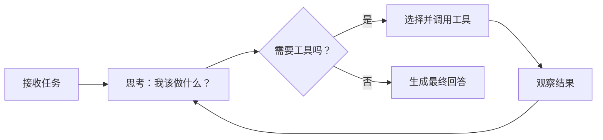
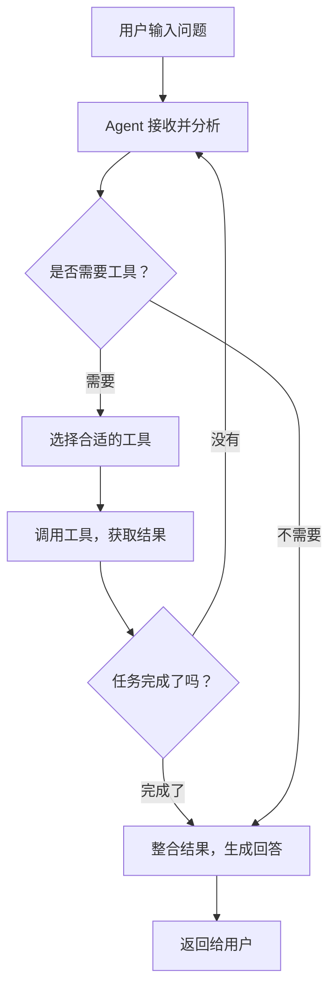

你可能已经用过 ChatGPT 进行对话，但你有没有想过：如果 AI 不只是"回答问题"，而是能**自己思考、自己决定下一步该做什么**，那会怎样？这就是 **AI Agent** 的核心思想。

今天我们就用 **LangChain** 来搭建一个最简单的 AI Agent，让你从零理解它是怎么工作的。

## 什么是 AI Agent？

简单来说，AI Agent = **大模型 + 工具 + 自主决策**。

普通的 LLM 调用是"一问一答"模式，而 Agent 的工作流程是：



核心思想就是 **ReAct**（Reasoning + Acting）：边思考边行动。

## 环境准备

首先确保你安装了必要的依赖：

```bash
pip install langchain langchain-openai python-dotenv
```

然后配置你的 API Key：

```env
OPENAI_API_KEY=sk-your-api-key-here
```

> 如果你用的是 DeepSeek 或其他兼容 OpenAI 格式的模型，也可以替换 `base_url`。

## 第一步：定义工具

Agent 的"超能力"来自于它可以调用工具。我们先定义两个简单的工具：

```python
from langchain_core.tools import tool

@tool
def search_web(query: str) -> str:
    """搜索互联网获取最新信息"""
    # 这里模拟搜索结果，实际项目中对接搜索 API
    results = {
        "天气": "今天北京晴天，气温 25°C",
        "新闻": "AI 行业最新融资动态：多家初创公司获得新一轮投资",
    }
    for key, value in results.items():
        if key in query:
            return value
    return f"搜索 '{query}' 的结果：暂无相关信息"

@tool
def calculate(expression: str) -> str:
    """计算数学表达式"""
    try:
        result = eval(expression)
        return f"计算结果：{expression} = {result}"
    except Exception as e:
        return f"计算出错：{str(e)}"
```

每个工具需要：
- **一个 `@tool` 装饰器**
- **清晰的函数名**：Agent 会根据名字判断用哪个工具
- **详细的 docstring**：Agent 靠描述来理解工具的用途

## 第二步：创建 Agent

接下来，把大模型和工具组合在一起，创建一个 Agent：

```python
from langchain_openai import ChatOpenAI
from langchain.agents import create_tool_calling_agent, AgentExecutor
from langchain_core.prompts import ChatPromptTemplate

# 1. 初始化大模型
llm = ChatOpenAI(
    model="gpt-4o-mini",
    temperature=0,       # 设为 0 让 Agent 决策更稳定
)

# 2. 定义 Prompt 模板
prompt = ChatPromptTemplate.from_messages([
    ("system", "你是一个智能助手，可以使用工具来帮助用户解决问题。"
               "请一步一步思考，必要时调用工具获取信息。"),
    ("human", "{input}"),
    ("placeholder", "{agent_scratchpad}"),
])

# 3. 绑定工具，创建 Agent
tools = [search_web, calculate]
agent = create_tool_calling_agent(llm, tools, prompt)

# 4. 包装成可执行的 Agent
executor = AgentExecutor(
    agent=agent,
    tools=tools,
    verbose=True,   # 打印思考过程，方便学习调试
)
```

### 各组件的作用

| 组件 | 作用 |
|------|------|
| `ChatOpenAI` | 大模型，Agent 的"大脑" |
| `@tool` | 工具函数，Agent 的"手脚" |
| `ChatPromptTemplate` | 提示词模板，指导 Agent 如何思考 |
| `AgentExecutor` | 执行器，驱动 Agent 循环运行 |

## 第三步：运行 Agent

现在可以测试了：

```python
# 测试 1：需要搜索的场景
result = executor.invoke({"input": "今天北京天气怎么样？"})
print(result["output"])

# 测试 2：需要计算的场景
result = executor.invoke({"input": "帮我算一下 123 * 456 + 789"})
print(result["output"])

# 测试 3：不需要工具的场景
result = executor.invoke({"input": "什么是 AI Agent？"})
print(result["output"])
```

### 运行效果

开启 `verbose=True` 后，你会看到 Agent 的完整思考链：

```
> Entering new AgentExecutor chain...

Invoking: `search_web` with `北京天气`
今天北京晴天，气温 25°C

今天北京天气晴朗，气温 25°C，适合外出活动！

> Finished chain.
```

Agent 自己判断出需要用 `search_web` 工具，调用后把结果整合成自然语言回答。

## 进阶：给 Agent 加记忆

默认的 Agent 每次对话都是独立的，加上记忆后可以实现多轮对话：

```python
from langchain_community.chat_message_histories import ChatMessageHistory
from langchain_core.runnables.history import RunnableWithMessageHistory

store = {}

def get_session_history(session_id: str):
    if session_id not in store:
        store[session_id] = ChatMessageHistory()
    return store[session_id]

agent_with_memory = RunnableWithMessageHistory(
    executor,
    get_session_history,
    input_messages_key="input",
    history_messages_key="chat_history",
)

# 多轮对话
config = {"configurable": {"session_id": "user-001"}}

agent_with_memory.invoke(
    {"input": "你好，我叫小明"}, config=config
)

agent_with_memory.invoke(
    {"input": "你还记得我叫什么吗？"}, config=config
)
# → Agent 会记住你叫小明
```

## Agent 的工作原理总结



核心循环就是：**思考 → 行动 → 观察 → 再思考**，直到任务完成。

## 小结

今天我们用 LangChain 搭建了一个简单的 AI Agent：

1. **工具是关键** — 好的工具描述让 Agent 更聪明
2. **Prompt 引导思考** — system prompt 决定 Agent 的行为风格
3. **AgentExecutor 驱动循环** — 自动处理"思考-行动-观察"的循环
4. **记忆让对话更自然** — 用 `RunnableWithMessageHistory` 实现多轮对话

这只是最基础的 Agent 实现。在实际项目中，你可以接入更多工具（数据库查询、API 调用、文件操作等），让 Agent 变得真正强大。

---

> 本文代码基于 LangChain 0.2+ 版本，API 可能随版本更新有所变化，请参考 [LangChain 官方文档](https://python.langchain.com/) 获取最新信息。
