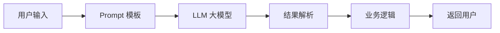
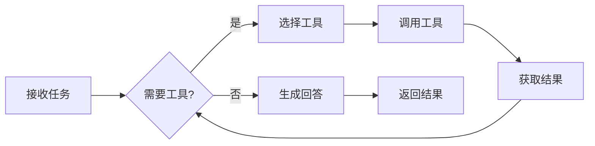
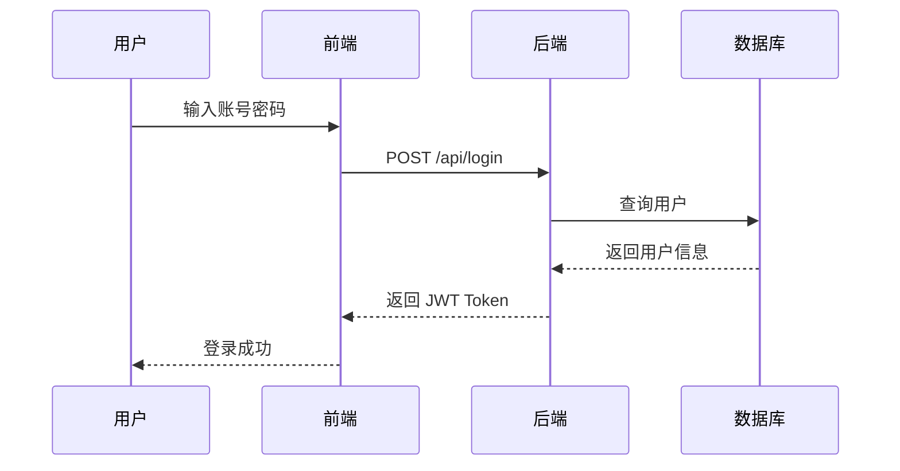
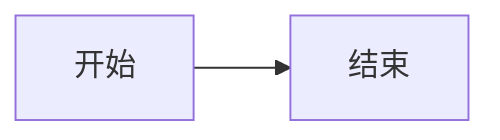

写技术文章时，一张好的架构图胜过千言万语。Mermaid 是一个用文本代码画图的工具，非常适合在 Markdown 博客中使用。

## 什么是 Mermaid？

Mermaid 是一个基于 JavaScript 的图表绘制工具，你可以用类似 Markdown 的简单语法来创建各种图表：

- 流程图 (Flowchart)
- 时序图 (Sequence Diagram)
- 状态图 (State Diagram)
- 甘特图 (Gantt Chart)
- ER 图 (Entity Relationship)

## 示例：AI 应用架构

下面是一个典型的 AI 应用架构图：



## 示例：AI Agent 工作流

AI Agent 的典型工作流程：



## 示例：用户认证时序图

一个典型的用户登录时序：



## 如何在博客中使用？

在 Markdown 文件中，用三个反引号加 `mermaid` 就可以了：

````

````

就这么简单！博客框架会自动渲染成漂亮的图表。

## 小技巧

1. **保持简洁** —— 图表节点不要太多，7-10 个最佳
2. **使用有意义的文字** —— 节点文字要能自解释
3. **选择合适的图表类型** —— 流程用 flowchart，交互用 sequence diagram
4. **注意方向** —— `LR` 是从左到右，`TD` 是从上到下

## 总结

Mermaid 是技术写作者的好帮手。用文本代码画图，既方便版本控制，又能保持图表和文章的一致性。

建议你在写技术博客时，遇到复杂流程就画一张 Mermaid 图，读者会感谢你的！

---

*下一篇文章，我计划分享如何用 LangChain 搭建一个简单的 AI Agent。*
